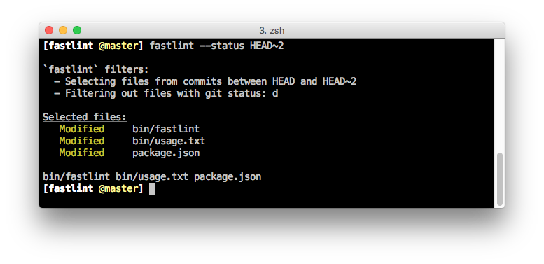

# fastlint

Lint faster by only running linters and other tools on files that have recently changed or files that are different from `master` in git.



## Installation

```
npm install -g fastlint
```

## Usage examples

`fastlint --status`

Runs `fastlint` and shows the current set of filters (in stderr).

`fastlint --status --print0 | xargs -0 eslint`

Run `eslint` on all modified files in the working copy.

`fastlint --status --print0 --working-copy HEAD HEAD~5 | xargs -0 eslint`

Run `eslint` on all files changed in the working copy and in the last five commits in this branch.

`fastlint HEAD origin/master | xargs -0 eslint`

Run `eslint` on all files changed compared to the `origin/master` branch.

`fastlint --status --print0 --glob '{src,tests}/**/*.{js,jsx}' HEAD origin/master | xargs -0 eslint`

Run `eslint` on all `.js` and `.jsx` files in `src/` or `tests/` changed compared to the `origin/master` branch.

## Integrating with package.json

Here is an example of a full integration inside `package.json`, runnable via `npm run-script fastlint`:

```
  "scripts": {
    "fastlint": "fastlint --status --print0 --glob '{src,tests}/**/*.{js,jsx}' --glob 'webpack*.js' --working-copy --diff-filter=AM HEAD origin/master | xargs -0 eslint --ext js,jsx || exit 0"
  },
```

## CLI options

### Filtering

`--glob [glob]`. Use a glob to filter the results. Can be specified multiple times. The matching is processed using [multimatch](https://github.com/sindresorhus/multimatch), see their docs for details.

`--working-copy`. `fastlint` can also include files in the working copy, e.g. files that have been added/modified but not necessarily staged. For UX reasons this gets set if you don't pass anything in.

`--diff-filter [(A|C|D|M|R|T|U|X|B|?)]`. Defaults to `--diff-filter d`. Select only files that are Added (A), Copied (C), Deleted (D), Modified (M), Renamed (R), have their type (i.e. regular file, symlink, submodule, …​) changed (T), are Unmerged (U), are Unknown (X), or have had their pairing Broken (B). Any combination of the filter characters (including none) can be used.

Also, these upper-case letters can be downcased to exclude. E.g. `--diff-filter=ad` excludes added and deleted paths.

### Human friendly status

`--status` logs out the list of selected files to `stderr`.

### Result formatting

- `--delimiter [character]`. Join the filenames using this delimiter. `\n`, `\t`, `\r` and `\0` are converted to the appropriate character. Default: ` `.
- `--print0`. Same as `--delimiter '\0'`.
- `--paths cwd`. Output paths relative to CWD. Default.
- `--paths full`. Output full paths.
- `--paths gitroot`. Output paths relative to the location of the closest `.git` folder, searching up from the current working directory.
